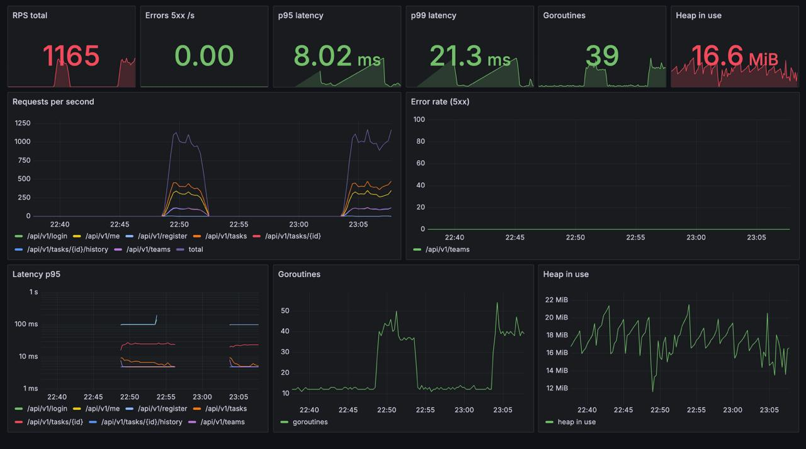
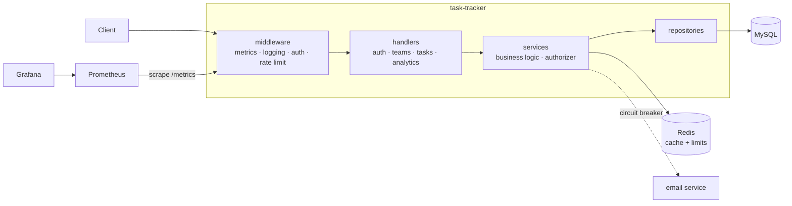

<div align="center">

# Task Tracker

Team task management REST API — roles, transactional audit history, full observability.

Go · chi · MySQL · Redis · Prometheus · Grafana · testcontainers

[](https://github.com/alextuchak/task_tracker/actions/workflows/ci.yaml)
[](go.mod)
[](https://github.com/alextuchak/task_tracker/releases)
[](LICENSE)

[Features](#features) · [Quick start](#quick-start) · [Architecture](#architecture) · [API](#api) · [Observability](#observability) · [Testing](#testing) · [Design decisions](#design-decisions) · [Development](#development)



</div>

## Features

- **Teams & RBAC** — team roles resolved per request, global admin bypass in one authorizer
- **Audited tasks** — field-level history written in the same transaction as the update
- **Keyset pagination** — cursor-based everywhere, no deep-page degradation
- **Redis** — task list cache (5 min TTL) and GCRA rate limiting (per-user and per-IP)
- **Admin analytics** — window functions, aggregations and an integrity anti-join report
- **Observability** — Prometheus metrics, provisioned Grafana dashboard, JSON logs
- **Operational hygiene** — two-phase graceful shutdown, startup pings, migration container

## Quick start

```bash
docker compose up -d --build
```

One command starts MySQL, Redis, the migrator, the API, Prometheus and Grafana.

| Endpoint   | URL                            | Credentials |
|------------|--------------------------------|-------------|
| API        | http://localhost:8080/api/v1   | —           |
| Swagger UI | http://localhost:8080/swagger/ | —           |
| Prometheus | http://localhost:9090          | —           |
| Grafana    | http://localhost:3000          | admin/admin |

```bash
# register and log in
curl -X POST localhost:8080/api/v1/register \
  -d '{"email":"ada@example.com","name":"Ada","password":"password123"}'
TOKEN=$(curl -s -X POST localhost:8080/api/v1/login \
  -d '{"email":"ada@example.com","password":"password123"}' | jq -r .access_token)

# create a team and a task, then complete it
curl -X POST localhost:8080/api/v1/teams \
  -H "Authorization: Bearer $TOKEN" -d '{"name":"backend"}'
curl -X POST localhost:8080/api/v1/tasks \
  -H "Authorization: Bearer $TOKEN" -d '{"team_id":1,"title":"ship it"}'
curl -X PUT localhost:8080/api/v1/tasks/1 \
  -H "Authorization: Bearer $TOKEN" -d '{"title":"ship it","status":"done"}'

# read the audit trail
curl -H "Authorization: Bearer $TOKEN" localhost:8080/api/v1/tasks/1/history
```

```json
[
  {"change_group_id": "d41d8cd9…", "field": "created", "old_value": "", "new_value": "", "changed_by": 1},
  {"change_group_id": "9e107d9d…", "field": "status", "old_value": "todo", "new_value": "done", "changed_by": 1}
]
```

Fields changed by one request share a `change_group_id` — Jira-style change groups.

## Architecture



JWT middleware resolves identity without touching the database; authorization
(team roles, admin bypass) happens in the service layer per request. Repositories
own raw SQL; the audit trail is written in the same transaction as the update.

## API

| Method & path                      | Description                                | Access |
|------------------------------------|--------------------------------------------|--------|
| `POST /api/v1/register`            | Register                                   | public (IP rate limit) |
| `POST /api/v1/login`               | Log in, returns JWT                        | public (IP rate limit) |
| `GET /api/v1/me`                   | Current user with global role              | authenticated |
| `POST /api/v1/teams`               | Create team, creator becomes owner         | authenticated |
| `GET /api/v1/teams`                | Teams the user belongs to                  | authenticated |
| `POST /api/v1/teams/{id}/invite`   | Invite user by email                       | team owner/admin |
| `POST /api/v1/tasks`               | Create task                                | team member |
| `GET /api/v1/tasks`                | List with filters + cursor pagination      | team member |
| `PUT /api/v1/tasks/{id}`           | Update task (audited)                      | team member |
| `GET /api/v1/tasks/{id}/history`   | Change history                             | team member |
| `GET /api/v1/analytics/*`          | Team stats / top creators / integrity      | global admin |

Full contract with schemas: **Swagger UI** at `/swagger/`.

The JWT carries identity only (`sub`, no roles — they would go stale). Team roles
are resolved per request from the database; the global admin bypass lives in a
single authorizer used by every service.

## Observability

Prometheus scrapes `/metrics` every 5s; Grafana auto-provisions the dashboard
shown above: an instant-value row, request rate, error rate, latency percentiles
(log scale) and runtime stats. The demo stack sustains ~900 rps locally with
p95 around 23ms and p99 around 120ms:

```bash
task loadgen   # 600 users, each within the 100 req/min per-user limit, for 3 minutes
```

Rate limits stay at their production values during the demo: throughput comes
from many users, not from lifting the limits. Localhost and the Docker network
are in `trusted_cidrs`, so only the anonymous per-IP limit is bypassed for the
generator — as it would be for a load balancer in production.

## Testing

```bash
task test        # everything, incl. integration (needs Docker)
task test-unit   # unit tests only
task cover       # coverage across all tests
```

The test strategy is sociable-first: the main suite spins real MySQL and Redis via
testcontainers, builds the actual application stack and exercises it through the HTTP
API. Mocks exist only for the unmanaged dependency (the external email service — an
`httptest` mock server with switchable failure mode). Unit tests cover pure logic:
JWT, middlewares, lifecycle, readiness states.

## Design decisions

- **Keyset over offset pagination** — index seek instead of read-and-discard; verified
  with `EXPLAIN ANALYZE` on 3M+ rows (~40k scanned rows per page down to exactly `limit`)
- **Audit in the write transaction** — application-level audit keeps the actor and
  intent; same-transaction writes make history drift impossible
- **No task status state machine** — any-to-any transitions like GitHub Issues;
  users must be able to roll a status back
- **Local circuit breaker, fresh-start closed** — per-instance state is the canonical
  choice; a shared breaker would add a Redis round-trip to every best-effort email
- **Centralized rate limiting** — GCRA counters in Redis solve multi-replica fairness
  and restart persistence at once; fails open, the limiter is protection, not a feature;
  trusted CIDRs (load balancers, internal infra) bypass only the anonymous per-IP limit
- **Documented tradeoffs over premature optimization** — top-creators runs window
  functions over live data (admin-only, seconds on millions of rows); the integrity
  report is a full-table anti-join by design

## Development

```bash
task -l                  # all tasks
task check               # gofumpt + golangci-lint
task swagger             # regenerate OpenAPI from annotations
task pre-commit-install  # hooks: fmt, lint, tidy, tests, swagger freshness
```

CI runs five parallel jobs on every PR commit — `lint` (golangci-lint), `govulncheck`,
`gosec`, `test-unit`, `test-integration` — and merges to `main` release automatically
via semantic-release (conventional commits → semver tag + changelog).

## Configuration

The YAML file is the single source of truth, mounted into the container
(`CONFIG_PATH=/config.yaml`). Environment variables carry only what never lives in
the file: `CONFIG_PATH`, `ENV`, `APP_VERSION`. See [config.yaml](config.yaml) for all
knobs: HTTP timeouts, MySQL pool, Redis, JWT secret/TTL, rate limits, circuit breaker
thresholds, shutdown budgets.

The first admin is granted by an operator, not by env variables:

```bash
go run ./cmd/cli grant-admin --email ada@example.com
```

## Project layout

```text
cmd/                      api, cli (admin ops), loadgen (demo traffic)
internal/
  domain/                 entities and domain errors, zero dependencies
  service/                business logic, owns repository interfaces, single authorizer
  identity/               embedded IdP: JWT issue/parse, request principal
  infrastructure/         mysql, redis cache, rate limiter, email breaker,
                          lifecycle (starter/closer), health, config, logging
  transport/http/         chi router; handlers grouped per resource
                          (auth, teams, tasks, analytics) with ozzo-validated DTOs
migrations/               goose SQL migrations (run by the migrator container)
tests/integration/        sociable API tests on testcontainers
deploy/                   prometheus + grafana provisioning
```

## License

[MIT](LICENSE)
